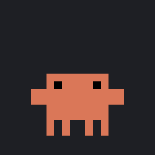

# Claw'dbot

*A crab. A robot. A very small colleague.*

Claw'd is a desktop pet for Windows that shows what Claude needs from you.

It sits on your screen, always on top, and reacts to what your Claude sessions are
doing: it works while Claude works, waves a flag when a task finishes, and hops when
Claude is waiting on you for a permission, an answer, or a prompt. Click it for a
popover that lists every session, what state it is in, and what it last wanted; click
a row to jump to that session in the Claude desktop app.

It is an attention device. Its whole job is to make "Claude needs you" impossible to
miss while you are looking at something else.

**Who is Claw'd?** Part crab, part robot, all pincers. Claw'd sits in the corner of
your screen and scuttles through the day alongside your Claude sessions: hammering at
a tiny laptop while Claude works, waving a flag when a task is done, hopping when
Claude has a question, and napping when nothing is going on (with a dream cloud in
which Claw'd is, naturally, still working). Claw'd can be big or small: from a
thumbnail in the corner to a fist-sized crab that is hard to ignore, which is rather
the point. The name is what it sounds like: Claude, with claws.



Claw'dbot is an independent hobby project. It is not made, endorsed, or supported by
Anthropic. The working animation and the optional `cli` skin are recreations of
Anthropic's Claude Code buddy; the rest of the art is original. See Credits below.

## What it watches

| Surface | How | What you get |
|---|---|---|
| Claude Code (CLI and the desktop app's Code tab) | Claude Code's own [hooks](https://docs.claude.com/en/docs/claude-code/hooks), posted to a local HTTP server on port 4317 | working, thinking, done, error, and every kind of "needs input", instantly |
| Cowork (the desktop app's agent mode) | The desktop app's Windows notifications (read from the notification store) and its log file | "Claude needs your answer" prompts, working while a session drives your folders, the session's title and folders |

Everything is observed locally. The pet never authenticates, never sends anything
anywhere, and never acts on your behalf: it does not approve, deny, or answer. It
listens on loopback only.

**Honesty note.** The Cowork side reads undocumented behaviour of the Claude desktop
app: the tags and text of its notifications, the format of lines in its log, and its
deep-link handling. Those change with app updates without notice, and the desktop
app updates itself silently. When that happens the pet says so (it goes "blind" and
shows why) rather than sitting there looking peacefully idle, but it will need a fix.
The measured details (notification tags and texts, log line formats, timings) are
documented in the source comments of `src-tauri/src/cowork/`. An official local status
feed from the desktop app would make all of that unnecessary; that is the feature
request this project exists to argue for.

## Install

Download `Clawdbot_0.1.0_x64-setup.exe` from the
[latest release](https://github.com/rubberdonut67/clawdbot/releases/latest) and run it.
It installs for your user only (no administrator prompt) and puts a **Clawdbot** entry
in the Start menu and a shortcut on the desktop. It needs Windows 11 and Claude Code;
for the Cowork side, the Claude desktop app from the Microsoft Store.

**The installer is unsigned.** Windows SmartScreen will show "Windows protected your PC"
with an unknown publisher the first time; "More info" and then "Run anyway" gets past
it. Signing would need a paid certificate tied to a verified identity, which this
project does not have. If you would rather not trust a download, build it yourself from
the source below; the whole thing is a few thousand lines and every part of it is here.

If you prefer no installer, the same release also has the bare `clawdbot.exe`: put it
anywhere and double-click it.

## Launch

Click **Clawdbot** in the Start menu, or the icon the installer put on the desktop.
Claw'd appears on screen a moment later, somewhere on your main screen the first time
and wherever you last dragged it after that. There is no window and no tray icon: the
crab is the whole app. Press `q` while it has focus to quit.

Then do the hook setup below, or the pet never hears about your Claude Code sessions.
Uninstall from Settings > Apps (it is listed as Clawdbot).

## Requirements (to build from source)

- Windows 11.
- Rust (stable) and the Tauri 2 build prerequisites (WebView2 is part of Windows 11).
- Claude Code installed, and for the Cowork side, the Claude desktop app from the
  Microsoft Store.

## Build

```
cd src-tauri
cargo build --release --features custom-protocol
```

The `custom-protocol` feature embeds the `src/` frontend into the exe. Copy
`target/release/clawdbot.exe` wherever you like and run it. Position and scale are
saved to `%APPDATA%\Clawdbot\config.json`.

To build the installer as well (needs Node), run from the repository root:

```
npx @tauri-apps/cli@2 build
```

That produces `src-tauri/target/release/bundle/nsis/Clawdbot_<version>_x64-setup.exe`.

## Hook setup for Claude Code

The pet learns about Claude Code sessions through hooks. Add the block in
`hooks/hook-settings.json` to `~/.claude/settings.json`, or run
`node hooks/merge-hooks.js`, which merges it and keeps a backup (and refuses to touch
a settings file that already has hooks). `node hooks/remove-hooks.js` undoes it.

Every hook is an HTTP POST with a two second timeout. The pet answers `200 {}` before
doing any work, so a slow or dead pet can never stall a Claude turn.


## Using it

- Hover Claw'd for a "+" that opens a new Claude Code session.
- Click Claw'd for the session popover. Rows show project (or session title), state,
  age, and the last detail; Cowork rows carry a `Cowork` pill.
- Click a row to open that session in the desktop app.
- The gear in the popover opens two rows: **theme** (system, dark, light) for the
  panels, and **skin** for Claw'd itself. `app` is the original crab; `cli` is a
  pixel recreation of the buddy that lives in the Claude Code terminal, wider and
  flatter with tall narrow eyes. Every state is drawn in both skins; the choice
  persists.
- Drag Claw'd to move; the position persists. Crabs are sideways creatures, but this
  one goes wherever you put it.
- Claw'd can be big or small. Click it, then `+` and `-` grow and shrink it in 15 %
  steps, from half size to three times size; `0` puts it back to the default. The
  size persists too.
- `q` quits (on purpose: there is no tray icon). Claw'd goes back in the shell.
- Left alone for a few minutes, Claw'd naps. A click or a drag wakes it.

## Configuration

`%APPDATA%\Clawdbot\config.json`:

```json
{
  "x": 100, "y": 100, "scale": 1.75,
  "cowork": {
    "enabled": true,
    "db_path": null,
    "log_path": null,
    "debug_injection": false
  }
}
```

`db_path` and `log_path` override the notification store and desktop log locations.
`debug_injection` opens `POST /cowork-event` on the local server so synthetic Cowork
events can be injected for testing. Leave it off: it lets any local process puppet
the pet.

`GET http://127.0.0.1:4317/state` returns the pet's current state as JSON at any time.

## Status

Personal project, built for one machine and one user, published as-is. Claw'd has one
owner, one screen, and strong opinions about laptops. Issues are
welcome but come with a log excerpt: the pet's `GET /state` output and the relevant
lines from `%LOCALAPPDATA%\Claude\logs\main.log` are what make a report actionable.

## Credits

- **The working animation** (the wind-up dance, the leap to the little laptop, and
  the typing loop) was designed by **Anthropic's Claude Code team** for the buddy
  that lives in the Claude Code CLI, and the crab-robot character is in its image.
  Claw'dbot's version is a hand-drawn recreation, measured frame by frame from
  recordings of that buddy so that its motion and timing are preserved. That
  choreography and the original character belong to Anthropic; this project claims no
  rights in them and would remove or redraw them on request. Anthropic does not
  publish the names of the artists behind the buddy; if you are one of them and want
  to be named here, open an issue.
- **The `cli` skin** is that same Claude Code buddy, redrawn as pixel art from
  Anthropic's public announcement of it: its resting shape and proportions are
  measured from that material, and every state of this project's animation set is
  then drawn on that body. The character is Anthropic's; the same disclaimer applies.
- **The flag wave** (the "done" animation) is adapted from **Ayotomiwa Wale-Durojaye**'s
  SVG and GSAP recreation of the Claude mascot animations, published on Codrops
  ([Reverse-Engineering Claude AI's Mascot Animations with SVG and GSAP](https://tympanus.net/codrops/2026/05/05/reverse-engineering-claude-ais-mascot-animations-with-svg-and-gsap/),
  demos under the MIT licence per Codrops' licensing terms). Copyright (c) Ayotomiwa
  Wale-Durojaye. Their work is itself a recreation of Anthropic's original animations.
- **The resting pose, the needs-attention hop, the sad rain, and the error
  animation** were made by **rubberdonut67**, the author of this project.
- Built with [Tauri 2](https://tauri.app), [rusqlite](https://github.com/rusqlite/rusqlite),
  and [tiny_http](https://github.com/tiny-http/tiny-http).

## License

MIT, see `LICENSE`. The licence covers this project's code, text, and original art;
it does not and cannot grant any rights in Anthropic's character or its working
animation.
